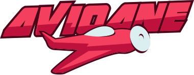

-------

## Introdução

Este repositório trata de um [jogo](http://is7s.com/index2.html) que passou por manutenção na disciplina de Manutenção de Software da UTFPR campus Dois Vizinhos, realizado por [Arthur Sosnowski](https://github.com/Kastango) e [Matheus Hoffmann](https://github.com/mhoffnn/hfmnn).

## Contextualização

Avioane é um [jogo desenvolvido por um desenvolvedor romeno em 2012](https://github.com/campuscodi/Avioane). Muito popular no país, o jogo é semelhante ao famoso jogo de Batalha Naval, porém envolve aviões. O objetivo do jogo é acertar os aviões posicionados no tabuleiro. O usuário pode posicionar 5 aviões em seu tabuleiro e, em seguida, alterna com seu oponente para tentar derrubar os aviões do adversário. O jogo utiliza HTML e JavaScript de maneira bastante simples.

## Manutenção

Durante a disciplina, foram coletadas uma série de possíveis solicitações de mudança para o jogo. Para realizar uma análise estática do código, utilizamos a ferramenta de visualização chamada [JSCity desenvolvido pela UFMG](https://github.com/aserg-ufmg/JSCity). Utilizamos um [fork](https://github.com/togakangaroo/JSCity/tree/dockerize) específico do projeto que permitiu o seu funcionamento no Docker.

Nossa principal tarefa foi adicionar padrões de código, diminuir a complexidade cognitiva, realizar a internacionalização do código e implementar uma nova interface.

## Trabalhos Futuros

Algumas ideias para implementação futura incluem a adição de um modo multiplayer utilizando websockets e a migração do desenvolvimento manual para um framework JavaScript, a fim de facilitar a manutenção e expansão do jogo.

## Agradecimentos

Gostaríamos de agradecer a Jonas Broder pela ajuda na criação do logo e a Gustavo Jansen pela orientação durante a disciplina, bem como ao desenvolvedor romeno pela criação da primeira versão do jogo em 2012.

## Limitações:
A documentação do jogo está em romeno, porém, caso necessário, pode-se utilizar o Google Translate para traduzi-la. Atualmente, o jogo suporta apenas o modo de um único jogador.

## Licença:
O jogo é gratuito para uso não comercial.

## Demo:

[Adicione a demo aqui](https://docs.github.com/pt/pages/getting-started-with-github-pages/creating-a-github-pages-site#creating-your-site:~:text=Criar%20reposit%C3%B3rio.-,Criar%20seu%20site,-Antes%20de%20criar)
